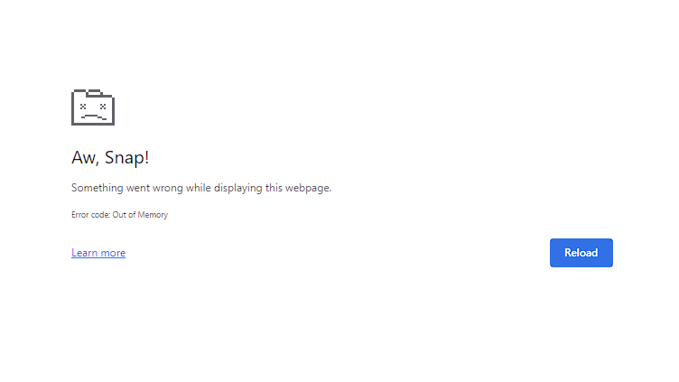

# Keyword Generation

<h3><code style="color:blue">Challenges Faced</code></h3>

<ul>
    <li>
         
        <strong>After a scraper script runs for a long time, sometimes it shows "Aw, Snap!" message in the running chrome. In that case, I just reloaded the webpage mannually and then it started working properly as previous.</strong>
    </li>
    <li>The required webelements distribution in all webpages wasn't the same. For some webpages, the scraper collecting details were working fine but it showed exceptions for those. So, I had to re-write some codes considering the different ones and generalize the codes.</li>
    <li>As I had to collect a lot of data, so, I created same type of scrapers and running them simultaneously from different indexes. It boosted my data collection process a bit although it depended much on internet speed.</li>
    <li>In the end, it took huge time to collect a desirable amount of data. So, I had to wait with patience.</li>
    <li>Some abstracts contains values like "Retracted.", "Final version", "IEEE Plagarism Policy." and some more unconsiderable values. So, I went through the whole dataset and found these values mannually for the data cleaning process.</li>
</ul>