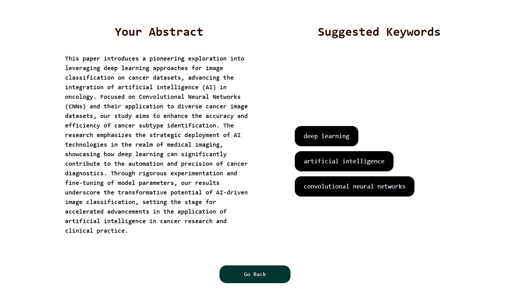

<h1>Scientific Paper Keywords Categorization</h1>

<h2>Project Development Journal</h2>

<h3><code style="color:blue">Problem Statement</code></h3>
<strong>Fetching papers abstract and keywords, I will create a multi-label keywords classifier that can classify an abstract within selected keywords.</strong>

<h3><code style="color:blue">Objective</code></h3>
<strong>Keywords is a necessary part of a scientific paper. It helps the search engines to show papers to their users based on relatable topics. So, choosing these words properly is really important. The goal here now is to create a developed and optimized keyword categorizer that can classify a scientific paper between particular keywords based on the abstract of the paper.</strong>

<h3><code style="color:blue">Data Collection</code></h3>
<strong>To collect data, I decided to scrape the available open access papers at <a href="https://ieeexplore.ieee.org/Xplore/home.jsp">IEEE</a>. I created the scraper files using selenium after inspecting the website. Firstly I collected the urls of the papers using "url_scraper". Then visiting the urls, I fetched the abstract and the IEEE and author keywords using "details_scraper". Facing some unpredictable issues, I managed to scrape data and stored them in different .csv files. You can check out the scraper files within "scrapers" folder.</strong>

<h3><code style="color:blue">Data Cleaning & Pre-processing</code></h3>
<strong>Within almost all the columns, there were some NaN or redundant values. In the case of "abstracts" column, some values were repetative and irrelavant. Those are considered as the inappropriate ones. So, those rows were deleted. Then I merged the IEEE and author keywords together. From there, I took the most commonly used keywords on the basis of the threshold value of 0.004. Henceafter, I dropped the rows having NaN or the rare keywords and created the final dataset. You can check the data cleaning part in the "data_cleaning" notebook. The following table shows the overview of initial and final csv files. The final dataset is available <a href="https://www.kaggle.com/datasets/neloybarman018/ieee-papers-abstract-and-keywords">here</a>.</strong>
<table align="center">
    <tr align="center">
        <th>File Name</th>
        <th>Data Type</th>
        <th>Rows</th>
        <th>Columns</th>
    </tr>
    <tr align="center">
        <td>merged_data</td>
        <td>Tabular Text</td>
        <td>40457</td>
        <td>3</td>
    </tr>
    <tr align="center">
        <td>papers_final_data</td>
        <td>Tabular Text</td>
        <td>36398</td>
        <td>2</td>
    </tr>
</table>

<h3><code style="color:blue">Dataloader Creation</code></h3>
<strong>I encoded the unique keywords. Then I proceed to the row-wise indexing for the available keywords of that row. For different models, the pre-processing part may differ. So, I imported the pre-defined configurations for each model. I splitted the dataset as 90% training and 10% validation set. Finally I created different dataloaders with a batch size of 16. You can check the data loader creation part in the "dataloader_creation" notebook.</strong>

<h3><code style="color:blue">Model Experimentations</code></h3>
<strong>To classify an abstract into multi-labels, I choose BERT and it's 2 variants. Those are: - </strong>
<ul>
<li>BERT</li>
<li>DistilBERT</li>
<li>RoBERTa</li>
</ul>
<strong>Training process: - </strong>
<ol>
<li>I freezed the model with it's pre-trained weights and ranged the learning rate between suitable values.</li>
<li>Then I trained the model for 10 epochs using fit_one_cycle() method.</li>
<li>After that, I unfreezed the trained model and again selecting a learning rate range, trained the model for 10 epochs.</li>
</ol>
<strong>In the case of BERT and DistilBERT, the whole training process gave a satisfactory result. But for RoBERTa, after unfreezing and training it again cost overfitting problem. So, it shows a better performance in its freezing phase.</strong>

<h3><code style="color:blue">Model Evaluation</code></h3>

    <table>
        <tr>
            <th rowspan="2">Model</th>
            <th colspan="3">Micro Average</th>
            <th colspan="3">Weighted Average</th>
        </tr>
        <tr>
            <th>Precision</th>
            <th>Recall</th>
            <th>F1-Score</th> 
            <th>Precision</th>
            <th>Recall</th>
            <th>F1-Score</th> 
        </tr>
        <tr align="center">
            <th>BERT</th>
            <td>62.211</td>
            <td>45.104</td>
            <td>52.294</td>
            <td>60.635</td>
            <td>45.104</td>
            <td>50.618</td>
        </tr>
        <tr align="center">
            <th>DistilBERT</th>
            <td>65.810</td>
            <td>40.588</td>
            <td>50.209</td>
            <td>63.739</td>
            <td>40.588</td>
            <td>48.119</td>
        </tr>
         <tr align="center">
            <th>RoBERTa</th>
            <td>69.113</td>
            <td>20.353</td>
            <td>31.446</td>
            <td>59.215</td>
            <td>20.353</td>
            <td>24.646</td>
        </tr>
    </table>

<strong>If we look at the evaluation table, it is clear that all our model is showing high precision and low recall values in all the cases. That's why a drastic change can be seen in the f1-score values. Although we got high precision values, but it is not showing a satisfactory results that meets expectation. In the case of BERT and DistilBERT, the models are not predicting all the expected classes but the predictions are selective and precise. That's why we see higher precision values. But it's not predicitng more extra classes 
that results in lower recall values. On the contrary, RoBERTa is more precise and correct. Though, it's predicting less extra classes. Finally, our balancing metric f1-score comes and it shows BERT as one of the best among these. Furthermore, I choose it to move forward with other tasks.</strong>

<h3><code style="color:blue">Model Compression</code></h3>
<strong>I compressed the model using ONNX. The model size got reduced to 87.45%. But the reduction costs a performance drop in the prediction. To evaluate this, I used micro average f1-score as the performance metrics. There is a 2.8% drop in the performance of the compressed model. </strong>

    <table>
        <tr align="center">
            <th>Model</th>
            <th>Size(MB)</th>
            <th>Performance</th>
        </tr>
        <tr align="center">
            <td>BERT</td>
            <td>838.8</td>
            <th>52.2939</th>
        </tr>
        <tr align="center">
            <td>Compressed BERT</td>
            <td>105.3</td>
            <th>50.8322</th>
        </tr>
    </table>

<h3><code style="color:blue">Deployment</code></h3>
<strong>I deployed the model using huggingface. Check out the deployment <a href="https://huggingface.co/spaces/nelbarman053/Scientific-Paper-Keyword-Categorization">here</a>.</strong>

    

<h3><code style="color:blue">Integration to website</code></h3>
<strong>I integrated the model using <a href="https://render.com/">render</a>. Check out the live website <a href="https://scientific-paper-keywords-categorization.onrender.com/">here</a>.</strong> 

    <table>
        <tr>
            <th>Home Page</th>
            <th>Prediction Result</th>
        </tr>
         <tr>
            <td></td>
            <td></td>
        </tr>
    </table>

<h3><code style="color:blue">Short Video Demonstration</code></h3>
<strong>I prepared a short video demonstration and shared it as a linked in post. Check it out <a href="https://www.linkedin.com/feed/update/urn:li:activity:7158861904692539393/">here</a>.</strong>

<h3><code style="color:blue">References</code></h3>
<strong>
    <ul>
        <li>Fallah, Haytame, et al. "Adapting transformers for multi-label text classification." CIRCLE (Joint Conference of the Information Retrieval Communities in Europe) 2022. 2022.</li>
    </ul>
</strong>

<h3><code style="color:blue">Challenges Faced</code></h3>
<ul>
    <li>
        <strong>After a scraper script runs for a long time, sometimes it shows "Aw, Snap!" message in the running chrome. In that case, I just reloaded the webpage mannually and then it started working properly as previous.</strong> 
         
    </li>
    <li><strong>The required webelements distribution in all webpages wasn't the same. For some webpages, the scraper collecting details were working fine but it showed exceptions for those. So, I had to re-write some codes considering the different ones and generalize the codes.</strong></li>
    <li><strong>As I had to collect a lot of data, so, I created same type of scrapers and running them simultaneously from different indexes. It boosted my data collection process a bit although it depended much on internet speed.</strong></li>
    <li><strong>Some abstracts contains values like "Retracted.", "Final version", "IEEE Plagarism Policy." and some more unconsiderable values. So, I went through the whole dataset and found these values mannually for the data cleaning process.</strong></li>
    <li><strong>In the end, it took huge time to collect a desirable amount of data. So, I had to wait with patience.</strong></li>
</ul>
